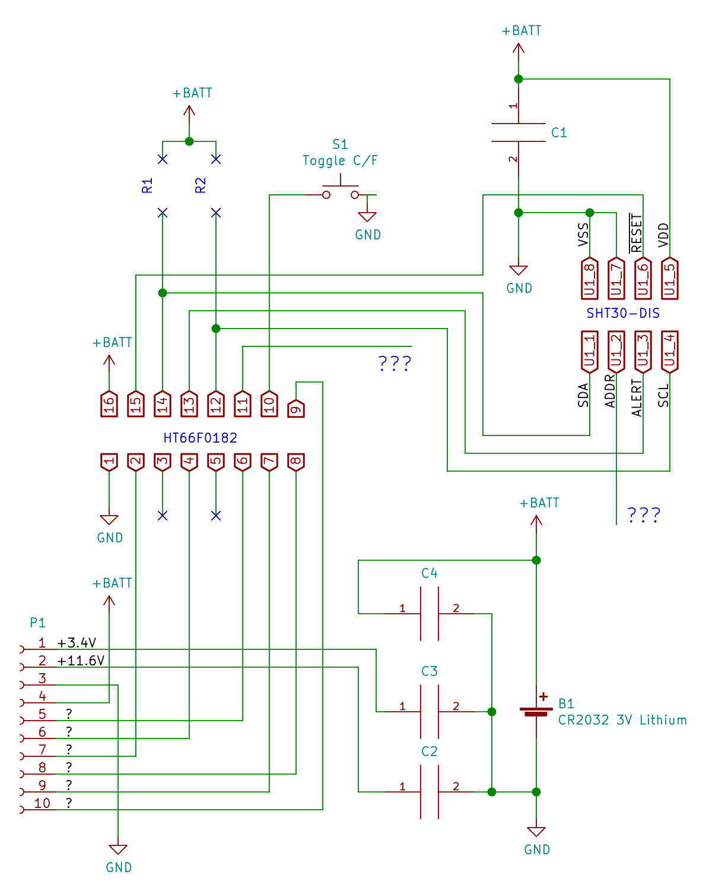

# MHO-C201 Teardown

## Schematic

## Components

- **Display** at **P1**: Segmented e-paper display connected to PCB with 10-pin FPC.
  - Pins (from "top")
    1. Regulated 3.4V for COG? Connected to capacitor at **C3**.
    2. +11.6V gate voltage? Connected to capacitor at **C2**.
    3. +BATT. Connected to nearby smoothing capacitor at **C4**.
    4. GND
    5. ???
    6. ???
    7. ???
    8. ???
    9. ???
    10. ???
  - Segments: visually there are 84 segments (TODO: confirm)
- **MCU** at **U2**: HT66F0182 [datasheet](datasheets/HT66F0182v110.pdf)

  - Pins
      1. GND
      2. Display P1-7
      3. Not connected
      4. Display P1-6
      5. Not connected
      6. Display P1-5
      7. Display P1-9
      8. Display P1-8
      9. Display P1-10
      10. S1 TODO: Confirm pull-up
      11. ???
      12. Sensor U1-4 I2C SCL
      13. Sensor U1-3 Alert
      14. Sensor U1-1 I2C SDA
      15. Sensor U1-6 Reset
      16. +BATT. Connected to nearby smoothing capacitor at **C4**.
- **Sensor** at **U1**: SHT30-DIS [datasheet](datasheets/SHT3X-DIS Sensirion_Humidity_Sensors_SHT3x_Datasheet_digital.pdf)

  - Pins
    1. SDA
    2. ADDR. Seems not connected but docs for SHT30-DIS say "do not leave floating"
    3. ALERT
    4. SCL
    5. +BATT. Connected to nearby to smoothing capacitor at **C1**
    6. RESET
    7. GND
    8. GND
- **Switch** at **S1**: Toggles between C and F units.
- **Capacitors**:
  - **C1** decoupling capacitor for sensor
  - **C2** capacitor connected to pin 1 of P1
  - **C3** capacitor connected to pin 2 of P1
  - **C4** decoupling capacitor for MCU and/or display controller
- **R1**/**R2** are footprints for pull-up resistors for the Sensor SDA/SCL lines but they're are unpopulated because MCU pins (14, 12) connected to the Sensor SDA/SCL are using internal pull-ups (TODO: confirm).

## Other Assets

- [MHO-C201 English User Manual.pdf](datasheets/MHO-C201 English User Manual.pdf)

