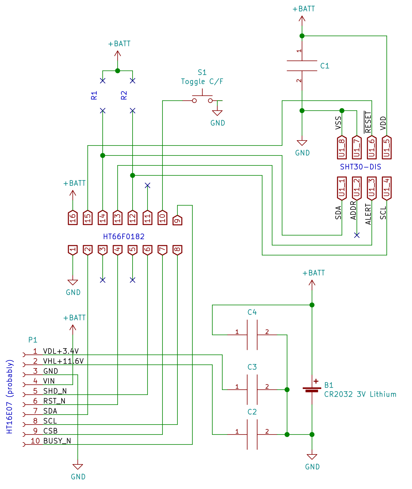

# MHO-C201 Teardown

## Schematic

## Components

- **Display** at **P1**: Segmented e-paper display controller connected to PCB with 10-pin FPC.

  - Probably a [**HT16E07**](https://www.holtek.com/productdetail/-/vg/16E07). The commands captured between the MCU and Display match the HT16E07 datasheet

    - Except the MCU here seems to send a 14-byte DTM command whereas the datasheet says 17 bytes are required otherwise "the result of the data comparison between the new_data register and the previous_data register will be incorrect."

  - Segments: visually there are 84 segments (TODO: confirm).

    - The HT16E07 supports 120 segments. Based on the logic analyzer captures, the DTM command sent is 14 bytes composed of 1 command-type byte followed 13 bytes of data. This means this display probably has at most 104 segments  (8 segments per byte * 13 bytes).

  - Pins (from "top")
    1. VDL
       - From HT16E07 datasheet:
         - 2.75V to 3.25V
         - Driver low supply voltage – bypass to GND with 1μF capacitor
       - Connected to capacitor at **C3**.
       - Measured voltage: 3.4V.
    2. VDH
       - From HT16E07 datasheet:
         - > Driver high supply voltage – bypass to GND with 1μF capacitor
         - > On startup **Panel Setting (PSR)** command sets to black/white. When black/white:  "VDH is fixed to 12V and VDL is set by the PWR command"
       - Connected to capacitor at **C2**.
       - Measured voltage 11.6V
    3. GND
    4. VDD

- Datasheet: 2.4 to 3.6V

    5. SHD_N
   - From datasheet:

     - > Charge pump enable pin – low shutdown

    6. RST_N
    7. SDA (data)
    8. SCL (clock)
    9. CSB (latch) (Low during data clock pulses, pulses high after 9 clocks pulses)
10. BUSY_N

    - From datasheet:

          - > Busy flag output pin
            > BUSY_N="0" – driver is busy, driver is refreshing the display
            > BUSY_N="1" – driver is idle, host can send command/data to driver
    - Based on observation, BUSY_N is pulled down by the display when busy, and floating when idle so the MCU pin connected to BUSY_N should have a pull-up resistor.

- **MCU** at **U2**: HT66F0182 [datasheet](datasheets/HT66F0182v110.pdf)
- Pins
      1. GND
      2. Display P1-7
      3. Not connected
      4. Display P1-6
      5. Not connected
      6. Display P1-5
      7. Display P1-9
      8. Display P1-8
      9. Display P1-10
      10. S1
      11. ???
      12. Sensor U1-4 I2C SCL
      13. Sensor U1-3 Alert
      14. Sensor U1-1 I2C SDA
      15. Sensor U1-6 Reset
      16. +BATT. Connected to nearby  capacitor at **C4**.

- **Sensor** at **U1**: SHT30-DIS [datasheet](datasheets/SHT3X-DIS Sensirion_Humidity_Sensors_SHT3x_Datasheet_digital.pdf)

  - Pins
    1. SDA
    2. ADDR. Seems not connected but docs for SHT30-DIS say "do not leave floating". MCU addresses Sensor using the default address 0x44 so assume this is "connected to logic low".
    3. ALERT
    4. SCL
    5. VDD
       - Datasheet: 2.15 - 5.5V. 3.3V typical
       - Connected to nearby to capacitor at **C1**
    6. nRESET
    7. R
       - Datasheet: No electrical function; to be connected to VSS
    8. VSS

- **Switch** at **S1**: Toggles between C and F units.

  - Connects MCU pin 10 to GND when pressed

- **Capacitors**:
  - **C1** decoupling capacitor for sensor
  - **C2** capacitor connected to pin 1 of P1
  - **C3** capacitor connected to pin 2 of P1
  - **C4** decoupling capacitor for MCU and/or display controller

- **R1**/**R2** are footprints for pull-up resistors for the Sensor SDA/SCL lines but they're are unpopulated probably because the MCU pins (14, 12) are using internal pull-ups.

## Product Manual and Datasheets

- [MHO-C201 English User Manual](datasheets/MHO-C201 English User Manual.pdf)

-  [HT16E07v100 120 Segments EPD Driver IC Datasheet](datasheets/HT16E07v100.pdf)

-  [HT66F0182v110 A/D Flash MCU Datasheet](datasheets/HT66F0182v110.pdf)

-  [SHT3X-DIS Humidity and Temperature Sensor Datasheet](datasheets/SHT3X-DIS Sensirion_Humidity_Sensors_SHT3x_Datasheet_digital.pdf)

## Startup and Update

### On startup the stock MCU:

The MCU sends updates the display 3 times on startup:

1. MCU powers on
2.  After 500 ms, sets Display SHD_N high
3. Update #1: Full clear. This update turns on then off all segments using special LUT values (see below for **Update Display Sequence**)
   - BUSY_N is low for 3,000 ms between after sending DRF
4. Wait 100ms
5. During this 100ms the MCU reads temp from Sensor
   1. Immediately after DRF, MCU writes "Single Shot Data Acquisition Mode" command to sensor: 0x2416 (no clock stretching, low repeatability)
   2. 86 ms later (maybe triggered by Sensor ALERT line, I didn't have logic analyzer hooked to this line), read 6 bytes from Sensor, 2-byte  temperature, 1-byte checksum, 2 byte humidity, 1-byte checksum.
   3. No other messages between MCU and Sensor observed in the first 10s after power on.
6. Update #2: Set off segments. After Update #1 all segments are off so this update doesn't seem necessary.
   - This time BUSY_N is low for 500 ms after DRF
7. Update #3: Set on segments. This turns on some segments (to show temp/humidity)
   1. This time BUSY_N is low for 1,00 ms after DRF
8. Sends final (third) CPOF
9. SHD_N low
10. RST_N pulse low for 1.5ms

### Update Display Sequence

After startup the MCU will periodically read the Sensor and sets on/off state of the segments. Each **Update Display Sequence** can only turn on or off segments but can't both turn off some and turn on some segments. So the **Update Display Sequence** needs to run twice: (1) turn off segments that shouldn't be on (2) turn on segments that should be on.

1. Send low pulse on RST_N 0.5ms

2. Wait 0.5ms

3. Send: Panel Setting (PSR)

4. Send: Power Setting (PWR)

5. Send: Charge Pump ON (CPON)

6. Wait for BUSY_N high

7. Send: Frame Rate Control (FRC)

8. Send: Frame Rate Control (FRC) (seems this second FRC i sonly sent on initial all-on refresh)

9. Send: LUTV, LUT_KK, LUT_KW

   - The LUT define the timing and voltages for turning on/off the segments
   - There are 3 sets of LUT values
     1. LUT values to fully clear the display by turning on and then off all the segments
     2. LUT values to turn off segments
     3. LUT values to turn on segments

10. Send: Data Start Transmission (DTM)

  - Datasheet:

    > Note that users must send the full 17-byte command at once. If less than a 17-byte command is sent, the contents of the previous_data register will be incorrect. In this case the outcome will be that the result of the data comparison between the new_data register and the previous_data register will be incorrect.

  - Logic analyzer capture shows DTM command is consistently 14 bytes.

  - Testing with custom code, DTM command can include any number of bytes (tested by sending 0 0x00 and 100 0x00). Any missing bytes seem to be assume is 0x00.

11. Send: Data Stop (DSP)

12. Send: Display Refresh (DRF)

13. BUSY_N goes low which means display is refreshing

    - Datasheet

      > After executing a DTM command and a DSP command, BUSY_N will be set to “0”.

14. Wait for BUSY_N high

    - Datasheet:

      > After finishing a display refresh, BUSY_N will be set to “1” and the data_flag wil be set to “0”.

15. Send: Charge Pump OFF (CPOF)

## Segments

#### Segment 94

Segment 94 turns on the parts of the display that are always on during normal usage:

- Degree symbol and common parts of C and F
- Decimal
- Side of faces
- Percent sign

#### Segment 96

Segment 96 is the "background"

